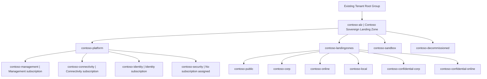
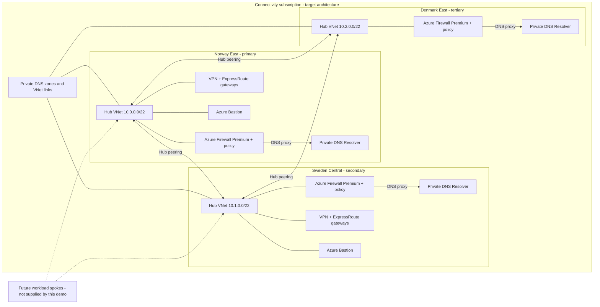

## Contoso Sovereign Landing Zone Demo

This repository contains the Contoso platform landing zone configuration generated
by the **Azure Landing Zones Terraform Accelerator** using **Azure Verified
Modules (AVM)**. It demonstrates an SLZ governance hierarchy and a three-region
hub-and-spoke network with Azure Firewall Premium.

**This is a demo.** The `prod` suffix is a naming choice, not a production-readiness
or compliance claim. The GitHub organization uses the Free plan, so these
repositories are public. Never commit credentials, Terraform state or saved plans.

**Documentation snapshot: 6 September 2026.** The initial feature-registration
issue was resolved and the two-region platform deployed successfully. A later
policy-stage apply failed while replacing policy-tagged public IPs. Recovery
[PR #6](https://github.com/janegilring-demo/contoso-prod/pull/6) preserved the
required tags and NSG associations and restored both Bastion hosts; recovery run
[34024636892](https://github.com/janegilring-demo/contoso-prod/actions/runs/34024636892)
succeeded, with read-only acceptance at 09:43 UTC.

Denmark [PR #5](https://github.com/janegilring-demo/contoso-prod/pull/5) is merged.
Its fresh delivery plan matched CI: 196 additions, 10 updates, zero destruction.
The approved
[regional run](https://github.com/janegilring-demo/contoso-prod/actions/runs/34025654500)
succeeded at 10:11 UTC. Read-only acceptance at 10:11:37 UTC verified the Danish
firewall, resolver, four new peerings, routes, and representative private DNS links.
Diagrams do not imply tested workload connectivity, automatic failover, or a
compliance certification.

## Configuration

| Setting | Demo choice |
| --- | --- |
| Primary region | Norway East (`norwayeast`) |
| Secondary region | Sweden Central (`swedencentral`) |
| Tertiary region | Denmark East (`denmarkeast`); firewall and DNS profile only |
| Platform subscriptions | Management, Connectivity and Identity |
| Existing parent | Tenant Root Group |
| Intermediate root | `contoso-alz` |
| Naming | Service `contoso`, environment `prod`, postfix `1` |
| Connectivity | `hub_and_spoke_vnet` |
| Paid DDoS Protection Plan | Disabled; associated auto-enable policies removed |
| Runners | GitHub-hosted |
| Apply approval | `contoso-prod-approvers` team, containing `janegilring` |
| ALZ PowerShell / bootstrap / starter | `7.1.5` / `v7.3.0` / `v17.5.1` |
| Terraform | `1.14.9` for the reviewed plan/apply workflow |
| SLZ library dependency | `platform/slz/2026.08.0` |

Subscription mappings and configuration are in
[terraform.tfvars.json](https://github.com/janegilring-demo/contoso-prod/blob/main/terraform.tfvars.json)
and [platform-landing-zone.auto.tfvars](https://github.com/janegilring-demo/contoso-prod/blob/main/platform-landing-zone.auto.tfvars).
Library customizations are in [lib](https://github.com/janegilring-demo/contoso-prod/tree/main/lib).

## Management-Group Architecture

Bootstrap created `contoso-alz` and initially attached the three subscriptions
directly beneath it. The platform configuration defines their final child-group
placement. Security is a reserved group; no fourth subscription was invented.

The SLZ model uses preview built-in initiatives aligned with:

- **L1: Data residency**, including region and service-specific replication controls.
- **L2: Encryption at rest and in transit**, including CMK with Key Vault Premium
  or Managed HSM keys, HTTPS and TLS-version controls.
- **L3: Encryption in use**, including confidential-computing controls.

The older Global and Confidential Sovereignty Baseline initiatives are historical
and were replaced in the April 2026 library update. Verify the selected library's
actual assignment IDs, effects and parameters, not only names or group existence.
The effective allowed locations are `norwayeast`, `swedencentral`, and
`denmarkeast`. This permits three geographies, not Denmark-only residency.

Local is intended for Azure Local workloads and Azure-public workloads with an
exit requirement to Azure Local disconnected operations. It is not a central
bucket for all Azure Arc resources. Resource-type eligibility alone does not
prove application portability or a tested exit plan.

## Regional Network Architecture

Regional routing reservations are `10.0.0.0/16`, `10.1.0.0/16`, and `10.2.0.0/16`;
the actual hub VNets use the `/22` ranges shown above. Future spokes use the
regional firewall as DNS proxy and the generated user-subnet routes for inspection.
Denmark has no Bastion, VPN gateway, or ExpressRoute gateway. Shared private DNS
zones remain owned in Norway. Logging, state, and Automation also remain in Norway.

The connectivity caller uses a locally maintained derivative of AVM pattern
version 0.17.2 to preserve inherited MCAPS public-IP tags and existing subnet NSG
references. See [patch provenance](modules/contoso-connectivity/PATCH-NOTES.md).
This is not a newly certified AVM release. Policy-created NSGs remain externally
owned; Terraform retains their verified associations without importing or deleting
the NSGs. The Danish resolver subnet had no NSG association at acceptance, so no
unverified NSG reference was added. Recheck later plans for a newly policy-created
association and preserve its verified ID before applying. Do not guess an NSG ID.

Verified Danish private IPs are firewall `10.2.0.4` and resolver `10.2.0.164`.
Read-only acceptance checked blob, Key Vault, and `denmarkeast.azure.local` VNet
links, not every DNS zone or data-plane query. No Danish gateways, Bastion or paid
DDoS plan were found.

Manual firewall power runbooks are managed separately by scripts in the local
`msftdemo/azure/automation/firewall-power` folder, not by this Terraform root.
No schedules, job-schedule links, or webhooks are part of that setup. Validation
does not stop traffic; actual deallocation requires an intentional outage decision.

The Management subscription hosts monitoring resources such as Log Analytics,
data collection rules and the AMA managed identity. No identity-service workload,
workload spoke, VPN connection or ExpressRoute circuit is provisioned by this
configuration. Multi-region hubs do not provide automatic application failover.

## Delivery and State Security

- [This repository](https://github.com/janegilring-demo/contoso-prod) owns platform configuration.
- [contoso-prod-templates](https://github.com/janegilring-demo/contoso-prod-templates)
  owns the reusable CI/CD workflows.
- CI formats/validates Terraform and produces a plan for pull requests.
- CD runs a plan, waits for the required apply environment reviewer, then applies
  that same saved plan. Both repositories have protected main branches.
- Separate managed identities authenticate using GitHub OIDC. Plan has Reader
  and apply has Owner at `contoso-alz`; both have blob data access to the state
  container. No Azure client secret is required by these workflows.
- Terraform state is in a Norway East ZRS storage account with TLS 1.2, shared
  keys disabled and anonymous blob access disabled.
- Saved plan bundles use the same access-controlled Azure container instead of
  public GitHub artifacts. The bundle includes the lockfile and excludes state,
  caches and Git metadata. It is deleted after a successful apply.

The initial run encountered a backend 403 because the inherited MCAPS policy
disabled storage public-network access. The user explicitly authorized the
policy's `SecurityControl=Ignore` tag exclusion **only on bootstrap state storage**.
Public-network access was then enabled, while blob authentication and RBAC remain
required. No resource-group or tenant-wide policy exemption was created. Review
other MCAPS controls that honor the same tag before reusing this demo exception.

### Running the Deployment

Check for an existing run before dispatching another deployment. In **Actions**,
select **02 Azure Landing Zones Continuous Delivery**, choose **Run workflow**,
use `terraform_action=apply` and `terraform_cli_version=1.14.9`, review the plan,
then approve `contoso-prod-apply`. The workflow also runs on pushes to main.

Do not substitute a local apply or remove protection rules to bypass approval.
For documentation-only commits, `[skip ci]` prevents an unnecessary CI/CD run;
it does not change branch-protection requirements.

## Recorded Changes and Validation

1. Bootstrap completed with 157 additions and no changes/deletions. This includes
   GitHub files and provider registrations, not just Azure infrastructure.
2. [Templates PR #1](https://github.com/janegilring-demo/contoso-prod-templates/pull/1)
   moved saved plan bundles to protected Azure storage.
3. The account-scoped storage exception restored backend access. CI and delivery
   plan jobs verified OIDC, state access and protected bundle upload.
4. [Platform PR #1](https://github.com/janegilring-demo/contoso-prod/pull/1) disabled
   the paid DDoS plan and removed `Enable-DDoS-VNET` from the connectivity and
   landing-zone archetypes. No replacement paid DDoS SKU was enabled.
5. [CI run 34014115414](https://github.com/janegilring-demo/contoso-prod/actions/runs/34014115414)
  passed with a 1509/0/0 plan and no paid DDoS resource. The first apply failed on
  feature registration; subsequent run `34016112611` deployed the baseline.
6. Policy PR #4 added Denmark to the requested locations. Its initial apply
  failed on attached VPN public-IP deletion, after recreating the two Bastion
  public IPs. No dependent firewall/gateway deletion was performed.
7. Recovery PR #6 applied a 2/24/0 plan without public-IP replacement or NSG
  removal. Live checks verified restored Bastions, working resource provisioning,
  all ten original-region public-IP tags, four NSG associations, and the
  three-region location policy with Deny intact.
8. Denmark PR #5 was rebased onto recovery and approved with a 196/10/0 plan.
  Delivery and the scoped control-plane acceptance both passed.

**Known logging gap:** ALZ assignment `Deploy-Diag-LogsCat` failed diagnostic
remediation for both Danish firewall public IPs because it requested category
group `audit`, while those resources advertise only `allLogs`. The failures are
separate from successful public-IP provisioning. The policy remains enabled;
changing shared logging scope and ingestion cost requires review. Regional
acceptance does not claim diagnostic-setting or workload compliance.

Terraform validation, focused configuration checks, and TFLint passed locally.
The recovery Checkov scan had 27 passes, 26 inherited `CKV_TF_1` registry-source
findings and zero parsing errors. AVM contributor checks could not run because
Docker is unavailable. These are not clean, exhaustive security-scan results.

Before declaring the demo complete, verify regional provisioning, hub peerings,
firewall policies, gateways, Bastion, DNS endpoints/zones/links, subscription
placement, L1/L2/L3 policy assignments and a subsequent no-unexpected-change plan.
Policy evaluation/propagation and workload compliance are separate checks.

## Cost and Cleanup

Reference fixed cost without the paid DDoS plan: **USD 5,333.72/month**, reduced
by **USD 2,944/month** from the source scenario's USD 8,277.72. These are westus
two-region estimates dated 2 April 2026, not Nordic prices, a Denmark quote, or
the current bill. The Danish firewall, resolver and public IPs add metered cost. Usage,
Defender, logging, egress, circuits and bootstrap add cost. Built-in Azure DDoS
infrastructure protection remains, but is not equivalent to DDoS Network Protection.

Preserve pre-existing resources in all three subscriptions. Do not use
subscription-wide cleanup or delete Tenant Root Group. Review exact demo resource
scopes before destruction, and retain the state backend and deployment identities
until dependent resources have been removed. A previous bootstrap re-plan proposed
state-container/RBAC replacements and was rejected: investigate drift before
rerunning bootstrap, rather than recreating state infrastructure.

## Reference Material

- [ALZ Terraform Accelerator](https://github.com/Azure/alz-terraform-accelerator)
- [Multi-region hub-and-spoke scenario and cost source](https://azure.github.io/Azure-Landing-Zones/accelerator/starter-terraform/scenarios/multi-region-hub-and-spoke-vnet-with-azure-firewall/)
- [SLZ option](https://azure.github.io/Azure-Landing-Zones/accelerator/starter-terraform/options/slz/)
- [Disable DDoS option](https://azure.github.io/Azure-Landing-Zones/accelerator/starter-terraform/options/ddos/)
- [Local management group and updated sovereign policies](https://techcommunity.microsoft.com/blog/azuregovernanceandmanagementblog/new-local-management-group-for-alz--updated-sovereign-policies-for-slz/4515156)
- [ALZ's Azure Migrate maintenance handover](https://techcommunity.microsoft.com/blog/azuregovernanceandmanagementblog/azure-landing-zone-alz-enters-its-next-chapter/4533520)
- [Cleanup guidance](https://azure.github.io/Azure-Landing-Zones/accelerator/faq/cleanup/)

ALZ remains open source and community-driven under Azure Migrate maintenance.
The maintenance handover does not require switching deployment tools, nor does
this demo claim to have been deployed by the Azure Migrate agent.
